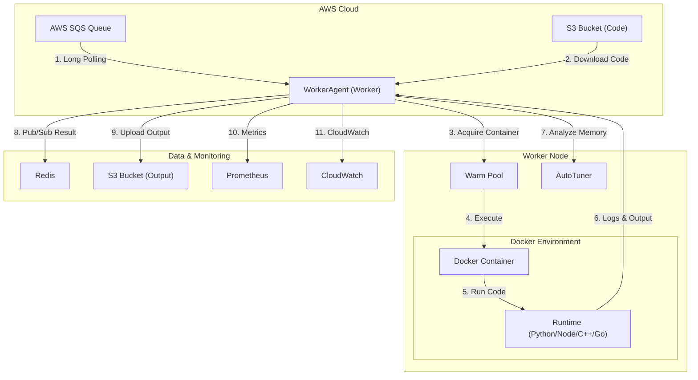

# Infra-worker (WorkerAgent)

<div align="center">


**High-Performance Serverless Task Executor for Infra**

</div>

---

## 📖 Introduction

`Infra-worker` (WorkerAgent) is the core execution unit of the serverless architecture. It receives tasks from **AWS SQS** and executes code securely within isolated **Docker** containers.

It goes beyond simple execution to provide enterprise-grade features such as **Zero Cold Start** via Warm Pools, **Memory Optimization (AutoTuner)**, **Security (Zip Slip Protection)**, and **Real-time Monitoring**.

---

## 🏗️ System Architecture



---

## 🚀 Key Features

### ⚡ Performance & Efficiency
| Feature | Description | Benefit |
| :--- | :--- | :--- |
| **SQS Long Polling** | Real-time task reception from SQS | Minimized Latency |
| **Warm Pool** | Maintains pre-warmed container pool (Python, Node, C++, Go) | **Zero Cold Start** |
| **AutoTuner** | Analyzes actual memory usage to suggest optimal allocation | **Cost Savings (up to 40%)** |
| **Streaming Execution** | Streams output directly to file without buffering | **Low Overhead (~90ms)** |

### 🔒 Security & Stability
- **Zip Slip Protection**: Automatically blocks path traversal attacks (`../../`) during decompression.
- **Docker Isolation**: Executes all tasks in isolated containers to protect the host system.
- **Resource Limits**: Enforces CPU/Memory quotas to prevent 'Noisy Neighbor' issues.
- **Time Limits**: Enforces hard timeouts per job to prevent infinite loops.

### 📊 Observability
- **Prometheus Exporter**: Exposes standard metrics on port `8000`.
- **CloudWatch Integration**: Sends peak memory usage metrics to AWS CloudWatch.
- **Execution Metadata**: Collects duration, peak memory, exit code, and stdout/stderr.

---

## 🛠️ Installation

### Prerequisites
*   Python 3.9+
*   Docker & Docker Compose
*   Redis Server
*   AWS Credentials (configured via `~/.aws/credentials` or Environment Variables)

### Setup Steps

```bash
# 1. Clone Repository
git clone https://github.com/sangmu1126/Infra-worker.git
cd Infra-worker

# 2. Install Dependencies
pip install -r requirements.txt

# 3. Setup Environment Variables
cp .env.example .env
# Edit .env file with your configurations

# 4. Run Agent
python agent.py
```

---

## ⚙️ Configuration

| Variable | Description | Default | Required |
| :--- | :--- | :--- | :---: |
| `AWS_REGION` | AWS Region | `ap-northeast-2` | No |
| `SQS_QUEUE_URL` | SQS Queue URL for tasks | - | **Yes** |
| `REDIS_HOST` | Redis Server Host | `localhost` | **Yes** |
| `REDIS_PORT` | Redis Server Port | `6379` | No |
| `S3_CODE_BUCKET` | S3 Bucket for Code | - | **Yes** |
| `S3_USER_DATA_BUCKET`| S3 Bucket for Output | - | **Yes** |
| `MAX_OUTPUT_SIZE` | Max Log Size (Bytes) | `1048576` (1MB) | No |
| `WARM_POOL_PYTHON_SIZE` | Python Warm Pool Size | `5` | No |
| `DOCKER_WORK_DIR_ROOT` | Host Working Directory | `/tmp/tasks` | No |

---

## 📈 Monitoring Metrics (Prometheus)

The Agent exposes metrics at `http://localhost:8000/metrics`.

| Metric Name | Type | Description | Labels |
| :--- | :--- | :--- | :--- |
| `worker_jobs_processed_total` | Counter | Total processed jobs | `status`, `runtime`, `model` |
| `worker_job_duration_seconds` | Histogram | Execution duration distribution | `runtime`, `model` |
| `worker_active_jobs` | Gauge | Currently active jobs | - |

---

## 📂 Project Structure

```bash
Infra-worker/
├── agent.py                 # Main Entrypoint: SQS Polling & Orchestration
├── executor.py              # TaskExecutor: Docker Management & Logic
├── uploader.py              # OutputUploader: S3 File Uploads
├── ai_client.py             # Injectable Client for User Code
├── requirements.txt         # Python Dependencies
├── infra-worker.service     # Systemd Service File
└── docker/                  # Dockerfiles for Runtimes
    ├── python/
    ├── nodejs/
    ├── cpp/
    └── go/
```

---

## 🧩 Usage Example

### Job Payload (JSON)
Task definition included in SQS message.

```json
{
  "requestId": "job-12345",
  "functionId": "func-abc",
  "runtime": "python",
  "s3Key": "users/user1/code.zip",
  "s3Bucket": "my-code-bucket",
  "memoryMb": 256,
  "timeoutMs": 10000,
  "input": {
    "key1": "value1"
  }
}
```

### Redis Result (Channel: `result:job-12345`)
```json
{
  "requestId": "job-12345",
  "status": "SUCCESS",
  "exitCode": 0,
  "stdout": "Hello World",
  "durationMs": 1250,
  "peakMemoryBytes": 15728640,
  "optimizationTip": "💡 Tip: Usage (15MB) < Limit (256MB)...",
  "outputFiles": [
    "https://s3.ap-northeast-2.amazonaws.com/my-bucket/outputs/job-12345/result.png"
  ]
}
```

---

<div align="center">
  <sub>Built with ❤️ by Softbank-Final Team</sub>
</div>
