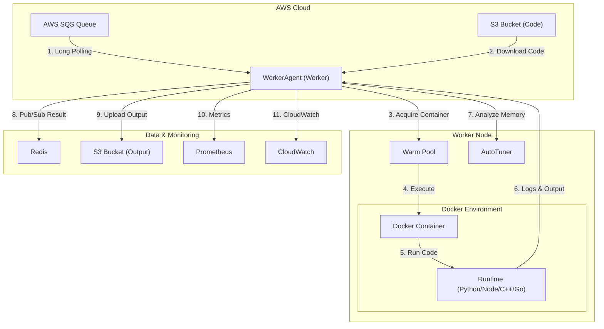

# ⚡ Infra-worker (WorkerAgent)

<div align="center">


**The Intelligent Execution Engine for Serverless Functions**

*Zero Cold Start • Resource Auto-Tuning • Microsecond Observability*

</div>

---

## 📖 Evaluation

**Infra-worker** is not just a job runner; it's an **AI-augmented execution environment**. It orchestrates the entire lifecycle of serverless functions—from secure isolation in Docker to real-time resource profiling.

It features the **Smart Auto-Tuner**, which analyzes execution patterns (CPU/Disk/Network) to automatically recommend the most cost-effective memory configuration, bridging the gap between performance and cost.

---

## 🏗️ System Architecture

The Worker Agent sits at the heart of the execution plane, bridging AWS infrastructure with isolated container runtimes.



---

## 🧠 Smart Auto-Tuner (New)
The **Auto-Tuner** is a built-in feedback loop that optimizes your infrastructure usage.

### How It Works
1.  **Deep Profiling**: While your code runs, the Worker monitors:
    *   **CPU**: User vs. System time (microsecond precision).
    *   **Memory**: Peak RSS usage via `cgroup.memory.peak`.
    *   **I/O**: Network Rx/Tx bytes and Disk Read/Write throughput.
2.  **Analysis**: The engine detects execution patterns:
    *   **🚨 Memory Risk**: Usage > 85% of limit (Risk of OOM).
    *   **💸 Resource Waste**: Usage < 30% of limit (Over-provisioned).
    *   **🐢 I/O Bound**: Low CPU but high latency (Network/Disk bottleneck).
3.  **Recommendation**: It calculates the **exact optimal memory (MB)** and estimates **monthly cost savings**.

> **Example Insight**: 
> *"💡 Resource Waste: You allocated 512MB but peak usage was only 45MB. Switch to 128MB to save $3.40/month."*

---

## 🚀 Key Features

| Feature | Description |
| :--- | :--- |
| **⚡ Zero Cold Start** | Pre-warmed containers (Warm Pool) ensure instant execution for Python, Node.js, Go. |
| **🛡️ Sec-Hardened** | Docker isolation, Zip Slip protection, and rigid resource quotas prevent breakout attacks. |
| **📡 Streaming I/O** | Direct S3 streaming for large payloads (GBs) with minimal memory footprint (~90ms overhead). |
| **📈 Live Metrics** | Exposes `worker_jobs_processed`, `duration_seconds`, and resource usage to Prometheus. |

---

## 🛠️ Installation & Setup

### Requirements
*   **OS**: Linux (Kernel 5.8+ recommended for Cgroup v2)
*   **Runtime**: Python 3.9+, Docker Engine
*   **Infra**: Redis (Message Bus), AWS Access

### Quick Start
```bash
# 1. Clone & Dependencies
git clone https://github.com/sangmu1126/Infra-worker.git
cd Infra-worker
pip install -r requirements.txt

# 2. Config
cp .env.example .env
# Set SQS_QUEUE_URL, REDIS_HOST, S3_CODE_BUCKET...

# 3. Launch
sudo python agent.py
```

---

## 📊 Observability

### Prometheus Metrics (`:8000/metrics`)
| Metric | Type | Description |
| :--- | :--- | :--- |
| `worker_eval_duration_seconds` | Histogram | Execution time distribution by runtime. |
| `worker_cpu_usage_seconds` | Counter | CPU time consumed by the agent. |
| `worker_memory_peak_bytes` | Gauge | Peak memory usage of the last job. |

### Execution Result (JSON)
The worker outputs a rich JSON result for every execution:

```json
{
  "requestId": "req-123",
  "status": "SUCCESS",
  "durationMs": 450,
  "resources": {
    "memoryUsedMb": 45,
    "cpuUsagePercent": 12.5,
    "networkTxBytes": 2048
  },
  "autoTuner": {
    "recommendation": "128MB",
    "savings": 75.0,
    "tip": "💡 [비용 절감] 메모리를 줄여 비용을 최적화하세요."
  }
}
```

---

<div align="center">
  <sub>Built for the Future of Serverless Computing</sub>
</div>
